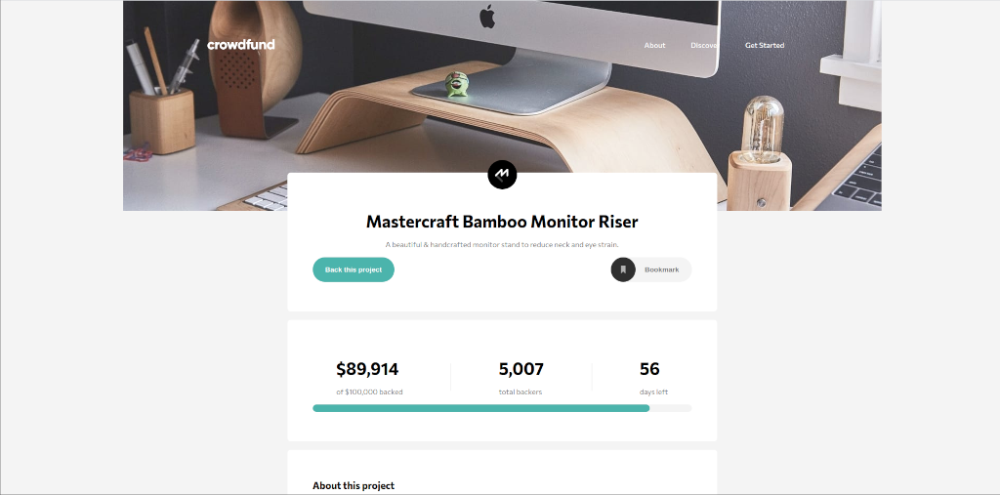
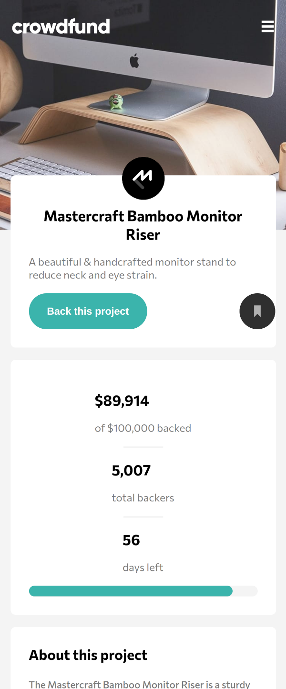

# Frontend Mentor - Crowdfunding product page solution

This is a solution to the [Crowdfunding product page challenge on Frontend Mentor](https://www.frontendmentor.io/challenges/crowdfunding-product-page-7uvcZe7ZR). Frontend Mentor challenges help you improve your coding skills by building realistic projects. 

## Table of contents

- [Frontend Mentor - Crowdfunding product page solution](#frontend-mentor---crowdfunding-product-page-solution)
  - [Table of contents](#table-of-contents)
  - [Overview](#overview)
    - [The challenge](#the-challenge)
    - [Screenshot](#screenshot)
      - [Desktop](#desktop)
      - [Mobile](#mobile)
    - [Links](#links)
  - [My process](#my-process)
    - [Built with](#built-with)
    - [What I learned](#what-i-learned)
    - [Continued development](#continued-development)
  - [Author](#author)

## Overview
Build out a crowdfunding product page and get it looking as close to the designs included within the design folder as possible.
### The challenge

Users should be able to:

- [x] View the optimal layout depending on their device's screen size
- [x] See hover states for interactive elements
- [x] Make a selection of which pledge to make
- [x] See an updated progress bar and total money raised based on their pledge total after confirming a pledge
- [x] See the number of total backers increment by one after confirming a pledge
- [x] Toggle whether or not the product is bookmarked

### Screenshot
#### Desktop

#### Mobile


### Links

- Live Site URL: http://github.obidex.com/crowd-funding-product-page/

## My process

- Apply semantic tags to HTML content
- Add CSS classes to each uniquely styled section
- Apply typography styles
- Apply Image & background styles
- Apply spacing (flexbox, padding, margin etc)
- Add Modals (and style as above)
- Add JavaScript functionality for modals
- Add media query for viewport breakpoints
- Add JavaScript and CSS for hamburger menu
- Add JavaScript functionality to increment counters
- Tweek values until satisfied

### Built with

- Semantic HTML5 markup
- CSS custom properties
- CSS media query
- JavaScript
- Flexbox

### What I learned

Expanding on the previous challenge this was a useful exercise in layouts spacing options and responsive design. In addition there are mobile specific elements to this project which look and operate different at different viewport sizes i.e. the hamburger menu:
```css
// Mobile Hamburger Menu
.navbar {
    padding: 1.5rem 1rem;
    flex-wrap: wrap;
}

.navbarlinks {
      margin-top: 1rem;
      display: none;
      background-color: white;
      border-radius: 1rem;
      width: 100%;
}
```


### Continued development

There is a lot of functionality and design that could be added to this but I would like to look at some multi-page builds and modular designs such as a dashboard. In a real world environment where the data would be dynamic I would use Ids to select the elements in JavaScript for demonstration purposes I have used element indicies which is not ideal.

## Author

- Website - [Matthew Ifould](https://obidex.com)
- Frontend Mentor - [@Ifouldm](https://www.frontendmentor.io/profile/ifouldm)
- Github - [Ifouldm](https://www.twitter.com/yourusername)


